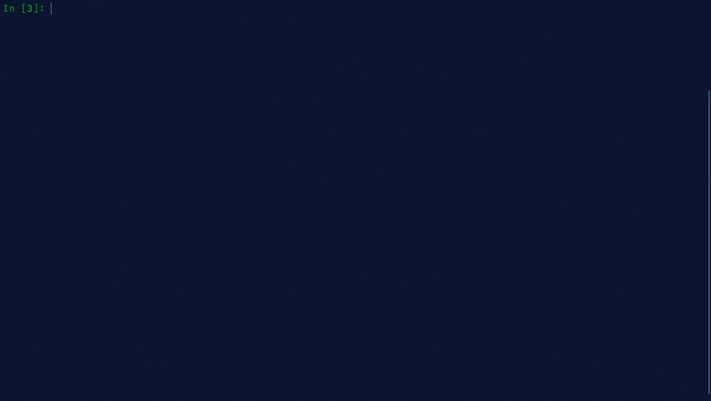

 


<svg xmlns="http://www.w3.org/2000/svg" width="613" height="162" viewBox="0 0 613 162" fill="none" nighteye="disabled">
<rect width="613" height="162" rx="22" fill="#02081B"/>
<path fill-rule="evenodd" clip-rule="evenodd" d="M135 25H103.152V40.0685H120.071V57.6891H135V25ZM85.7346 25H30V40.0685H70.8057V89.7945H120.071V135H135V74.726H85.7346V25Z" fill="white"/>
<path d="M55.4366 102H72L46.2676 138H30L55.4366 102Z" fill="white"/>
<path d="M135 58V25H103V40.3H119.889V58H135Z" fill="#80CB53"/>
<path d="M471.183 92.8074V80.776H492.18C497.579 80.776 501.744 79.407 504.674 76.6691C507.644 73.8926 509.128 69.9978 509.128 64.9847V64.869C509.128 59.8174 507.644 55.9226 504.674 53.1847C501.744 50.4468 497.579 49.0778 492.18 49.0778H471.183V36.9307H495.882C501.512 36.9307 506.448 38.0876 510.69 40.4013C514.97 42.715 518.306 45.9735 520.697 50.1768C523.088 54.3415 524.283 59.2197 524.283 64.8112V64.9269C524.283 70.4798 523.088 75.358 520.697 79.5612C518.306 83.726 514.97 86.9845 510.69 89.3368C506.448 91.6505 501.512 92.8074 495.882 92.8074H471.183ZM463.721 120.399V36.9307H478.645V120.399H463.721Z" fill="white"/>
<path d="M406.318 121.845C398.181 121.845 391.143 120.09 385.205 116.581C379.305 113.072 374.735 108.097 371.496 101.657C368.295 95.179 366.695 87.5244 366.695 78.6936V78.5779C366.695 69.7472 368.314 62.1118 371.554 55.6719C374.793 49.2321 379.363 44.2575 385.263 40.7484C391.201 37.2392 398.219 35.4846 406.318 35.4846C414.416 35.4846 421.415 37.2392 427.315 40.7484C433.253 44.2575 437.823 49.2321 441.024 55.6719C444.263 62.1118 445.882 69.7472 445.882 78.5779V78.6936C445.882 87.5244 444.263 95.179 441.024 101.657C437.823 108.097 433.273 113.072 427.372 116.581C421.472 120.09 414.454 121.845 406.318 121.845ZM406.318 108.946C411.369 108.946 415.707 107.712 419.332 105.244C422.957 102.737 425.753 99.228 427.72 94.7162C429.686 90.1659 430.67 84.825 430.67 78.6936V78.5779C430.67 72.408 429.667 67.0671 427.662 62.5553C425.695 58.005 422.88 54.5151 419.217 52.0857C415.592 49.6177 411.292 48.3837 406.318 48.3837C401.382 48.3837 397.082 49.6177 393.418 52.0857C389.755 54.5151 386.921 57.9857 384.915 62.4975C382.91 67.0092 381.908 72.3694 381.908 78.5779V78.6936C381.908 84.8636 382.891 90.2237 384.858 94.7741C386.863 99.2858 389.697 102.776 393.361 105.244C397.024 107.712 401.343 108.946 406.318 108.946ZM427.835 128.844L402.558 93.5015H417.366L442.585 128.844H427.835Z" fill="white"/>
<path d="M299.573 92.8074V80.776H320.571C325.969 80.776 330.134 79.407 333.065 76.6691C336.034 73.8926 337.519 69.9978 337.519 64.9847V64.869C337.519 59.8174 336.034 55.9226 333.065 53.1847C330.134 50.4468 325.969 49.0778 320.571 49.0778H299.573V36.9307H324.272C329.903 36.9307 334.839 38.0876 339.08 40.4013C343.361 42.715 346.696 45.9735 349.087 50.1768C351.478 54.3415 352.674 59.2197 352.674 64.8112V64.9269C352.674 70.4798 351.478 75.358 349.087 79.5612C346.696 83.726 343.361 86.9845 339.08 89.3368C334.839 91.6505 329.903 92.8074 324.272 92.8074H299.573ZM292.112 120.399V36.9307H307.035V120.399H292.112Z" fill="white"/>
<path d="M185.425 120.399V36.9307H202.663L228.229 100.732H228.634L254.201 36.9307H271.438V120.399H258.019V60.9935H251.135L266.348 39.2444L233.493 120.399H223.371L190.516 39.2444L205.728 60.9935H198.845V120.399H185.425Z" fill="white"/>
<rect x="538" y="106" width="47" height="14" fill="#80CB53"/>
<script xmlns="" id="bw-fido2-page-script"/><auto-scroll xmlns="http://www.w3.org/1999/xhtml"></auto-scroll></svg>

# The MPQP library

MPQP stands for Multi-Platform Quantum Programming. It is a python library we at
Colibri felt the need for but couldn't find a solution. We are working on
quantum algorithms, but until now, there was no good solution to study quantum
algorithms across devices, compares the devices, etc...

MPQP is thus the solution we bring to the community to tackle this problem.



On this page, you will find:

1. how to [install](#install) the library;
2. how to [start using](#usage) it;
3. how to [contribute](#contribute) to the development;
4. and the current active [contributors](#contributors).

## Install

For now, we support python versions 3.9 to 3.11, and both Windows and Linux
(specifically, if was validated on Ubuntu LTS 20.04, while Ubuntu 18.04 is not
supported). MacOS versions will come very soon!

The preferred installation method is with the `pipy` repo. In order to use this
installation method, simply run

```
pip install mpqp
```

You can also clone this repo and install from source, for instance if you need
to modify something. In that case, we advise you to see the
[Contribute](#contribute) section of this document.

## Usage

To get started with MPQP, you can create a quantum circuit with a few gates, and
run it against the backend of your choice:

```py
from mpqp import QCircuit
from mpqp.gates import *
from mpqp.execution import run, IBMDevice
circ = QCircuit([H(0), H(1), Rx(0,0), CNOT(1,2), Y(2)])
print(circ)
#      ┌───┐┌───────┐
# q_0: ┤ H ├┤ Rx(0) ├─────
#      ├───┤└───────┘
# q_1: ┤ H ├────■─────────
#      └───┘  ┌─┴─┐  ┌───┐
# q_2: ───────┤ X ├──┤ Y ├
#             └───┘  └───┘
print(run(circ, IBMDevice.AER_SIMULATOR_STATEVECTOR))
# Result: IBMDevice, AER_SIMULATOR_STATEVECTOR
#
#         State vector: [0.-0.j  0.+0.5j 0.-0.5j 0.+0.j  0.-0.j  0.+0.5j 0.-0.5j 0.+0.j ]
#         Probabilities: [0.   0.25 0.25 0.   0.   0.25 0.25 0.  ]
#         Number of qubits: 3
```

More details are available in our [documentation](https://mpqpdoc.colibri-quantum.com).

## Contribute

To contribute, once you cloned this repo, you'll need to install the development
dependencies.

```
pip install -r requirements-dev.txt
```

We advise you to get in touch with us on
[our Discord server](https://discord.gg/yyukutWbzf) so we help you on any
difficulty you may encounter along the way.

Two tools are useful when working on MPQP:

- the test suite
- the documentation generation

If you need to try out some behaviors of the library during the development, you
can install it from source using the command.

```
pip install .
```

### Tests

To run the test suite, run the following command:

```sh
python -m pytest
```

By default, long tests are disables to be more friendly to regularly run for
devs. The full suit can be run by adding the option `-l` or `--long` to the
previous command. This should still be run regularly to validate retro
compatibility.

<!-- 3M-TODO: add doctest for doc testing and tox for multiversions testing -->

### Documentation

The website documentation is generated with
[sphinx](https://www.sphinx-doc.org/en/master/index.html). You probably don't
need to generate it if you work on new features, but if you want to help us by
improving the documentation, you need to know two things:

- how our documentation is structured, _i.e._ most of it is in the docstrings in
  the code. This is done on purpose to keep code and documentation close
  together.
- you only need to run one command to generate the documentation:

```
sphinx-build -b html docs build
```

The changelog is generated from github's versions section. For this to work, you
need to get a github token with public repo read right and save is as an
environment variable with the key `SPHINX_GITHUB_CHANGELOG_TOKEN`.
Alternatively, you can create a `.env` file by duplicating the `.env.example`
one and removing the `.example` extension, and replace in this file the ellipsis
by your token. This said, you don't need the changelog to generate to work on
the documentation.

## Contributors

Henri de Boutray - ColibriTD

Hamza Jaffali - ColibriTD

Muhammad Attallah - ColibriTD
